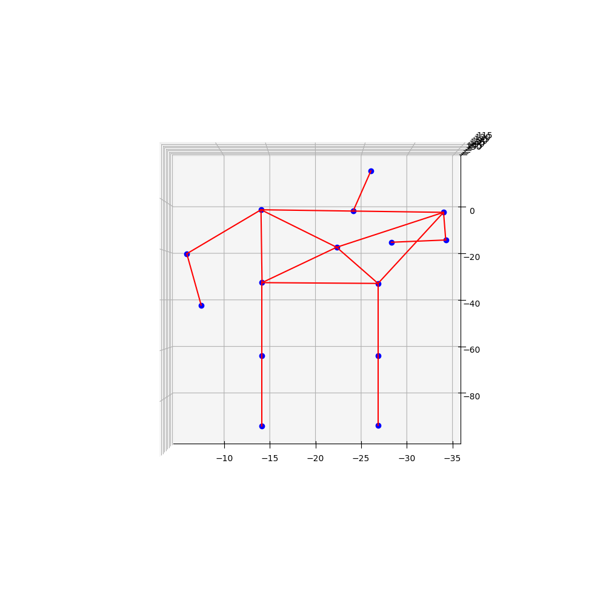

# Motion Render Example Project

Example of using the `motion-render` package along with example
experimental test data to render.

This package creates movies from motion capture data.  For example, this project
was developed to render movies for research projects using a simple
Kinet 3D skeletion tracking position estimator.  Data is expected to be
in a simple csv format, consisting of a timestamp and then 3D position of
a set of joints. 

The package provides functions to load in data, help convert it to
the needed format, and render the data as images and movies.  The
package relies on Python 3 Matplotlib plotting and movie animations
using the `mpl_toolkits.mplot3d` and `matplotlib.animation`
libraries.  This package uses mpeg as a back end renderer to create
the rendered animations.

# Dependencies

This package relies on Python 3, and the
matplotlib and pandas packages.  You can install
them using your user python package manager, for example

```
$ sudo pip install matpltlib pandas
```

You will need ffmpeg or some other movie rendering backend
supported by the `matplotlib.animation` library.
On a debian linux apt managed system, you can install
ffmpeg usually from the standard packages

```
$ sudo apt install ffmpeg
```

The [`motionrender`](https://pypi.org/project/motionrender) 
package should be available from download
through the PyPi pip package management repository.
A pip install of the package should install it into
your default python3 local packages

```
$ sudo pip install motionrender
Collecting motionrender
  Downloading motionrender-0.1.0-py3-none-any.whl (17 kB)
Installing collected packages: motionrender
Successfully installed motionrender-0.1.0

```

# Usage

There is an example set of joint position data from 
the [Smith et. al. replication](https://econtent.hogrefe.com/doi/10.1027/1618-3169/a000567)
study on the influence of posture on attention.  This dataset
contains motion capture data from a basic
Kinect depth-sensing device that collected
rough 3D joint position estimates of subjects in the
sitting and standing conditions of the replication
study.  The dataset can be found in the
data subdirectory of this repository.

To render an example frame of joint data from the
project, clone the project in the usual way and
run

```
$ python test-plot.py
```

The code shows how to import the module,
load the dataset and plot a frame of the
joint position data.  The basic motion capture
frame for this dataset looks like the following:



To render an visualization (animated movie)
of the time series of data collected,
run the following

```
$ python test-render.py
```

The result will be a rendered video file of the
subject test data.  The movie wil be rendered
in the same directory named `subject-skeleton.mov`
